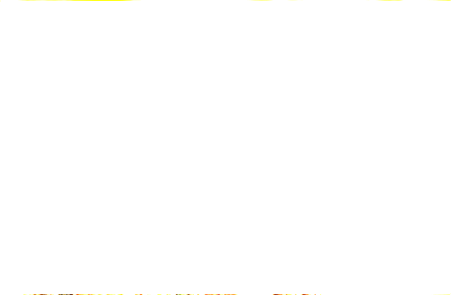
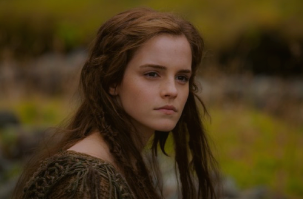
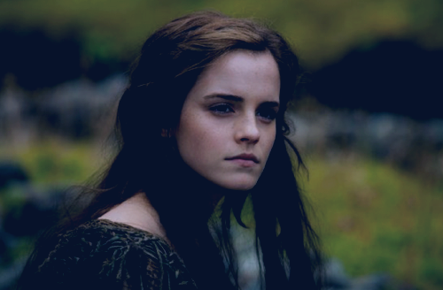
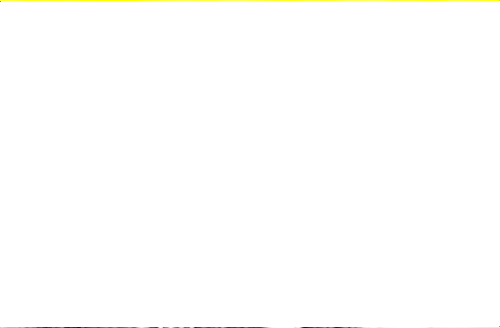
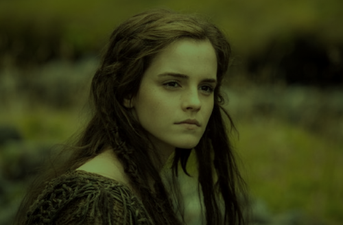
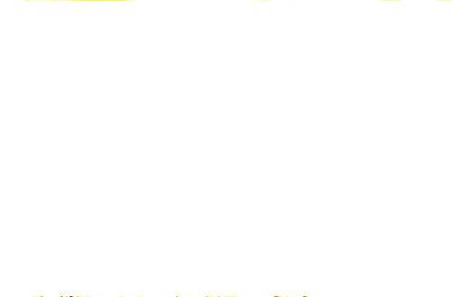
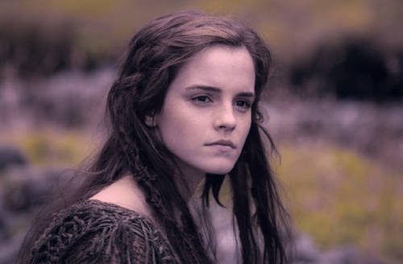
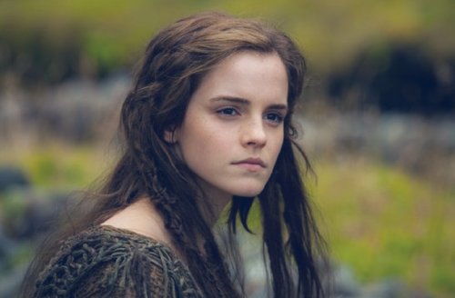

<!-- Autogenerated : 2017-02-05 19:56:47:395748 -->
# See# (See Sharp) documentation

_**WARNING:** The library's soruce code is not for the faint of heart. It is ported legacy-code from an older project._

### Defined effects:

 - **`AddBitmapBlendEffect`**
 - **`AddBlendColorEffect`**
 - **`AdditiveNashvilleBitmapEffect`**
    
 - **`AdenBitmapEffect`**
    
 - **`BitmapColorEffect`**
 - **`BitmapTransformEffect`**
 - **`BrightnessBitmapEffect`**
 - **`ContrastBitmapEffect`**
 - **`DarkerBitmapBlendEffect`**
 - **`DarkerOnlyBlendColorEffect`**
 - **`DifferenceBitmapBlendEffect`**
 - **`DifferenceBlendColorEffect`**
 - **`DivideBitmapBlendEffect`**
 - **`DivideBlendColorEffect`**
 - **`ED88BitmapEffect`**
 - **`EdgeDetectionBitmapEffect`**
 - **`EmbossBitmapEffect`**
 - **`EngraveBitmapEffect`**
 - **`FastBlurBitmapEffect`**
 - **`FastSharpenerBitmapEffect`**
 - **`Gaussian5x5BitmapEffect`**
 - **`GaussianBlurBitmapEffect`**
 - **`GrayscaleBitmapEffect`**
 - **`HardLightBlendColorEffect`**
 - **`HSLBitmapColorEffect`**
 - **`InkwellBitmapEffect`**
    
 - **`InvertBitmapEffect`**
 - **`KirschBitmapEffect`**
    
 - **`Laplace5x5BitmapEffect`**
 - **`LighterBitmapBlendEffect`**
 - **`LighterOnlyBlendColorEffect`**
 - **`LoFiBitmapEffect`**
    
 - **`MultiplyBitmapBlendEffect`**
 - **`MultiplyBlendColorEffect`**
 - **`NashvilleBitmapEffect`**
    
 - **`NormalMapBitmapEffect`**
 - **`OpacityBitmapEffect`**
 - **`OverlayBitmapBlendEffect`**
 - **`OverlayBlendColorEffect`**
 - **`PrewittBitmapEffect`**
    
 - **`RemainderBitmapBlendEffect`**
 - **`RemainderBlendColorEffect`**
 - **`ReyesBitmapEffect`**
    
 - **`RGBSplitBitmapEffect`**
 - **`SaturationBitmapEffect`**
 - **`ScharrBitmapEffect`**
    
 - **`ScreenBitmapBlendEffect`**
 - **`ScreenBlendColorEffect`**
 - **`SepiaBitmapEffect`**
 - **`SharpenerBitmapEffect`**
 - **`SimpleGlowBitmapEffect`**
 - **`SmoothWaldenBitmapEffect`**
    
 - **`SobelBitmapEffect`**
    
 - **`SoftLightBlendColorEffect`**
 - **`SubtractBitmapBlendEffect`**
 - **`SubtractBlendColorEffect`**
 - **`TintBitmapEffect`**
 - **`WaldenBitmapEffect`**
    
