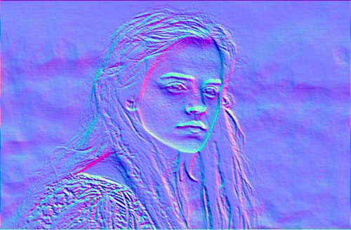
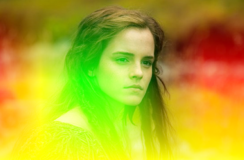
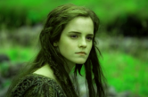
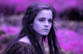

<!-- Autogenerated : 2017-02-07 16:52:36:208670 -->
# See# documentation _(beta!)_

_**WARNING:** The library's soruce code is not for the faint of heart. It is ported legacy-code from an older project._ 
_**WARNING:** This markdown document has been autogenerated by one of the worst C# programs I've ever written ..... so use it at your own risk..._

### Defined effects:
The See# Library has a few (61) pre-defined bitmap effects.
The following list contains all pre-defined effects and (in most cases) a generated image rendered with the respective bitmap effect.
The test images used are the following two:

<table>
    <tbody>
        <tr>
            <th>emma.png</th>
            <th>hsv_map.png</th>
        </tr>
        <tr>
            <td></td>
            <td></td>
        </tr>
    </tbody>
</table>

Effect list:
<ul>
<li><a name="AddBitmapBlendEffect"/><b><code>AddBitmapBlendEffect</code></b>
   

<table>
    <tbody>
        <tr>
            <th><code>Blend(emma, hsv_map)</code></th>
            <th><code>Blend(hsv_map, emma)</code></th>
        </tr>
        <tr>
            <td>
                
            </td>
            <td>
                
            </td>
        </tr>
    </tbody>
</table>

</li>
<li><a name="AddColorBlendEffect"/><b><code>AddColorBlendEffect</code></b>
   
This effect is identical to it's bitmap blending counterpart -- except for the fact, that it does not blend two bitmaps, but one bitmap and a color.
    <a href="#AddBitmapBlendEffect">Click here</a> to jump to the corresponding bitmap blending effect.

The effect can be initialized using one of the following constructors (besides from the default-constructor):<ul>
<li><b><code>AddColorBlendEffect(System.Drawing.Color clr)</code></b> 
<i>clr:</i> 
</li>
<li><b><code>AddColorBlendEffect(System.Double r, System.Double g, System.Double b)</code></b> 
<i>r:</i>  <i>g:</i>  <i>b:</i> 
</li>
<li><b><code>AddColorBlendEffect(System.Double a, System.Double r, System.Double g, System.Double b)</code></b> 
<i>a:</i>  <i>r:</i>  <i>g:</i>  <i>b:</i> 
</li>
</ul>

</li>
<li><a name="AdditiveNashvilleBitmapEffect"/><b><code>AdditiveNashvilleBitmapEffect</code></b>
   
This is a bitmap effect ported from Instagram's CSS code 

</li>
<li><a name="AdenBitmapEffect"/><b><code>AdenBitmapEffect</code></b>
   
This is a bitmap effect ported from Instagram's CSS code 

</li>
<li><a name="BrightnessBitmapEffect"/><b><code>BrightnessBitmapEffect</code></b>
   
The effect <code>SeeSharp.Effects.BrightnessBitmapEffect</code> uses the following color matrix multiplied with each pixel information to calculate the output color at any given pixel coordinated: 
<table><tbody><tr><th></th><th>R</th><th>G</th><th>B</th><th>A</th><th>O</th></tr><tr><th>R</th><td>1</td><td>0</td><td>0</td><td>0</td><td>0</td></tr><tr><th>G</th><td>0</td><td>1</td><td>0</td><td>0</td><td>0</td></tr><tr><th>B</th><td>0</td><td>0</td><td>1</td><td>0</td><td>0</td></tr><tr><th>A</th><td>0</td><td>0</td><td>0</td><td>1</td><td>0</td></tr><tr><th>F</th><td>1</td><td>1</td><td>1</td><td>1</td><td>1</td></tr></tbody></table>
   

   
Effect applied to ... 
<table>
    <tbody>
        <tr>
            <th>0%</th>
            <th>25%</th>
            <th>50%</th>
            <th>75%</th>
            <th>100%</th>
        </tr>
        <tr>
<td></td><td></td><td></td><td></td><td></td></tr></tbody></table>

The effect can be initialized using one of the following constructors (besides from the default-constructor):<ul>
<li><b><code>BrightnessBitmapEffect(System.Double amount)</code></b> 
<i>amount:</i> 
</li>
</ul>

</li>
<li><a name="ContrastBitmapEffect"/><b><code>ContrastBitmapEffect</code></b>
   
The effect <code>SeeSharp.Effects.ContrastBitmapEffect</code> uses the following color matrix multiplied with each pixel information to calculate the output color at any given pixel coordinated: 
<table><tbody><tr><th></th><th>R</th><th>G</th><th>B</th><th>A</th><th>O</th></tr><tr><th>R</th><td>1</td><td>0</td><td>0</td><td>0</td><td>0</td></tr><tr><th>G</th><td>0</td><td>1</td><td>0</td><td>0</td><td>0</td></tr><tr><th>B</th><td>0</td><td>0</td><td>1</td><td>0</td><td>0</td></tr><tr><th>A</th><td>0</td><td>0</td><td>0</td><td>1</td><td>0</td></tr><tr><th>F</th><td>0.5</td><td>0.5</td><td>0.5</td><td>1</td><td>1</td></tr></tbody></table>
   

   
Effect applied to ... 
<table>
    <tbody>
        <tr>
            <th>0%</th>
            <th>25%</th>
            <th>50%</th>
            <th>75%</th>
            <th>100%</th>
        </tr>
        <tr>
<td></td><td></td><td></td><td></td><td></td></tr></tbody></table>

The effect can be initialized using one of the following constructors (besides from the default-constructor):<ul>
<li><b><code>ContrastBitmapEffect(System.Double amount)</code></b> 
<i>amount:</i> 
</li>
</ul>

</li>
<li><a name="DarkerBitmapBlendEffect"/><b><code>DarkerBitmapBlendEffect</code></b>
   

<table>
    <tbody>
        <tr>
            <th><code>Blend(emma, hsv_map)</code></th>
            <th><code>Blend(hsv_map, emma)</code></th>
        </tr>
        <tr>
            <td>
                
            </td>
            <td>
                
            </td>
        </tr>
    </tbody>
</table>

</li>
<li><a name="DarkerOnlyColorBlendEffect"/><b><code>DarkerOnlyColorBlendEffect</code></b>
   
This effect is identical to it's bitmap blending counterpart -- except for the fact, that it does not blend two bitmaps, but one bitmap and a color.
    <a href="#DarkerOnlyBitmapBlendEffect">Click here</a> to jump to the corresponding bitmap blending effect.

The effect can be initialized using one of the following constructors (besides from the default-constructor):<ul>
<li><b><code>DarkerOnlyColorBlendEffect(System.Drawing.Color clr)</code></b> 
<i>clr:</i> 
</li>
<li><b><code>DarkerOnlyColorBlendEffect(System.Double r, System.Double g, System.Double b)</code></b> 
<i>r:</i>  <i>g:</i>  <i>b:</i> 
</li>
<li><b><code>DarkerOnlyColorBlendEffect(System.Double a, System.Double r, System.Double g, System.Double b)</code></b> 
<i>a:</i>  <i>r:</i>  <i>g:</i>  <i>b:</i> 
</li>
</ul>

</li>
<li><a name="DifferenceBitmapBlendEffect"/><b><code>DifferenceBitmapBlendEffect</code></b>
   

<table>
    <tbody>
        <tr>
            <th><code>Blend(emma, hsv_map)</code></th>
            <th><code>Blend(hsv_map, emma)</code></th>
        </tr>
        <tr>
            <td>
                
            </td>
            <td>
                
            </td>
        </tr>
    </tbody>
</table>

</li>
<li><a name="DifferenceColorBlendEffect"/><b><code>DifferenceColorBlendEffect</code></b>
   
This effect is identical to it's bitmap blending counterpart -- except for the fact, that it does not blend two bitmaps, but one bitmap and a color.
    <a href="#DifferenceBitmapBlendEffect">Click here</a> to jump to the corresponding bitmap blending effect.

The effect can be initialized using one of the following constructors (besides from the default-constructor):<ul>
<li><b><code>DifferenceColorBlendEffect(System.Drawing.Color clr)</code></b> 
<i>clr:</i> 
</li>
<li><b><code>DifferenceColorBlendEffect(System.Double r, System.Double g, System.Double b)</code></b> 
<i>r:</i>  <i>g:</i>  <i>b:</i> 
</li>
<li><b><code>DifferenceColorBlendEffect(System.Double a, System.Double r, System.Double g, System.Double b)</code></b> 
<i>a:</i>  <i>r:</i>  <i>g:</i>  <i>b:</i> 
</li>
</ul>

</li>
<li><a name="DivideBitmapBlendEffect"/><b><code>DivideBitmapBlendEffect</code></b>
   

<table>
    <tbody>
        <tr>
            <th><code>Blend(emma, hsv_map)</code></th>
            <th><code>Blend(hsv_map, emma)</code></th>
        </tr>
        <tr>
            <td>
                
            </td>
            <td>
                
            </td>
        </tr>
    </tbody>
</table>

</li>
<li><a name="DivideColorBlendEffect"/><b><code>DivideColorBlendEffect</code></b>
   
This effect is identical to it's bitmap blending counterpart -- except for the fact, that it does not blend two bitmaps, but one bitmap and a color.
    <a href="#DivideBitmapBlendEffect">Click here</a> to jump to the corresponding bitmap blending effect.

The effect can be initialized using one of the following constructors (besides from the default-constructor):<ul>
<li><b><code>DivideColorBlendEffect(System.Drawing.Color clr)</code></b> 
<i>clr:</i> 
</li>
<li><b><code>DivideColorBlendEffect(System.Double r, System.Double g, System.Double b)</code></b> 
<i>r:</i>  <i>g:</i>  <i>b:</i> 
</li>
<li><b><code>DivideColorBlendEffect(System.Double a, System.Double r, System.Double g, System.Double b)</code></b> 
<i>a:</i>  <i>r:</i>  <i>g:</i>  <i>b:</i> 
</li>
</ul>

</li>
<li><a name="ED88BitmapEffect"/><b><code>ED88BitmapEffect</code></b>
   

The effect can be initialized using one of the following constructors (besides from the default-constructor):<ul>
<li><b><code>ED88BitmapEffect(System.Boolean grayscale)</code></b> 
<i>grayscale:</i> 
</li>
</ul>

</li>
<li><a name="EdgeDetectionBitmapEffect"/><b><code>EdgeDetectionBitmapEffect</code></b>
   
The effect <code>SeeSharp.Effects.EdgeDetectionBitmapEffect</code> uses a single <a href="https://en.wikipedia.org/wiki/Convolution">convolution matrix</a> to calculate the resulting image: 
<table><tbody><tr><td>-1</td><td>-1</td><td>-1</td></tr><tr><td>-1</td><td>8</td><td>-1</td></tr><tr><td>-1</td><td>-1</td><td>-1</td></tr></tbody></table>   

   

</li>
<li><a name="EmbossBitmapEffect"/><b><code>EmbossBitmapEffect</code></b>
   
The effect <code>SeeSharp.Effects.EmbossBitmapEffect</code> uses a single <a href="https://en.wikipedia.org/wiki/Convolution">convolution matrix</a> to calculate the resulting image: 
<table><tbody><tr><td>-2</td><td>-1</td><td>0</td></tr><tr><td>-1</td><td>1</td><td>1</td></tr><tr><td>0</td><td>1</td><td>2</td></tr></tbody></table>   

   

</li>
<li><a name="EngraveBitmapEffect"/><b><code>EngraveBitmapEffect</code></b>
   
The effect <code>SeeSharp.Effects.EngraveBitmapEffect</code> uses a single <a href="https://en.wikipedia.org/wiki/Convolution">convolution matrix</a> to calculate the resulting image: 
<table><tbody><tr><td>-2</td><td>0</td><td>0</td></tr><tr><td>0</td><td>2</td><td>0</td></tr><tr><td>0</td><td>0</td><td>0</td></tr></tbody></table>   

   

</li>
<li><a name="ExcessiveSharpenerBitmapEffect"/><b><code>ExcessiveSharpenerBitmapEffect</code></b>
   
The effect <code>SeeSharp.Effects.ExcessiveSharpenerBitmapEffect</code> uses a single <a href="https://en.wikipedia.org/wiki/Convolution">convolution matrix</a> to calculate the resulting image: 
<table><tbody><tr><td>1</td><td>1</td><td>1</td></tr><tr><td>1</td><td>-7</td><td>1</td></tr><tr><td>1</td><td>1</td><td>1</td></tr></tbody></table>   

   

</li>
<li><a name="FastBlurBitmapEffect"/><b><code>FastBlurBitmapEffect</code></b>
   
The effect <code>SeeSharp.Effects.FastBlurBitmapEffect</code> uses a single <a href="https://en.wikipedia.org/wiki/Convolution">convolution matrix</a> to calculate the resulting image: 
<table><tbody><tr><td>0.0204</td><td>0.0204</td><td>0.0204</td><td>0.0204</td><td>0.0204</td><td>0.0204</td><td>0.0204</td></tr><tr><td>0.0204</td><td>0.0204</td><td>0.0204</td><td>0.0204</td><td>0.0204</td><td>0.0204</td><td>0.0204</td></tr><tr><td>0.0204</td><td>0.0204</td><td>0.0204</td><td>0.0204</td><td>0.0204</td><td>0.0204</td><td>0.0204</td></tr><tr><td>0.0204</td><td>0.0204</td><td>0.0204</td><td>0.0204</td><td>0.0204</td><td>0.0204</td><td>0.0204</td></tr><tr><td>0.0204</td><td>0.0204</td><td>0.0204</td><td>0.0204</td><td>0.0204</td><td>0.0204</td><td>0.0204</td></tr><tr><td>0.0204</td><td>0.0204</td><td>0.0204</td><td>0.0204</td><td>0.0204</td><td>0.0204</td><td>0.0204</td></tr><tr><td>0.0204</td><td>0.0204</td><td>0.0204</td><td>0.0204</td><td>0.0204</td><td>0.0204</td><td>0.0204</td></tr></tbody></table>   

   

The effect can be initialized using one of the following constructors (besides from the default-constructor):<ul>
<li><b><code>FastBlurBitmapEffect(System.Double radius)</code></b> 
<i>radius:</i> 
</li>
</ul>

</li>
<li><a name="FastSharpenerBitmapEffect"/><b><code>FastSharpenerBitmapEffect</code></b>
   
The effect <code>SeeSharp.Effects.FastSharpenerBitmapEffect</code> uses a single <a href="https://en.wikipedia.org/wiki/Convolution">convolution matrix</a> to calculate the resulting image: 
<table><tbody><tr><td>0</td><td>0</td><td>0</td><td>-1</td><td>0</td><td>0</td><td>0</td></tr><tr><td>0</td><td>0</td><td>0</td><td>-1</td><td>0</td><td>0</td><td>0</td></tr><tr><td>0</td><td>0</td><td>0</td><td>-1</td><td>0</td><td>0</td><td>0</td></tr><tr><td>-1</td><td>-1</td><td>-1</td><td>13</td><td>-1</td><td>-1</td><td>-1</td></tr><tr><td>0</td><td>0</td><td>0</td><td>-1</td><td>0</td><td>0</td><td>0</td></tr><tr><td>0</td><td>0</td><td>0</td><td>-1</td><td>0</td><td>0</td><td>0</td></tr><tr><td>0</td><td>0</td><td>0</td><td>-1</td><td>0</td><td>0</td><td>0</td></tr></tbody></table>   

   

The effect can be initialized using one of the following constructors (besides from the default-constructor):<ul>
<li><b><code>FastSharpenerBitmapEffect(System.Double radius)</code></b> 
<i>radius:</i> 
</li>
</ul>

</li>
<li><a name="Gaussian5x5BitmapEffect"/><b><code>Gaussian5x5BitmapEffect</code></b>
   
The effect <code>SeeSharp.Effects.Gaussian5x5BitmapEffect</code> uses a single <a href="https://en.wikipedia.org/wiki/Convolution">convolution matrix</a> to calculate the resulting image: 
<table><tbody><tr><td>1</td><td>4</td><td>6</td><td>4</td><td>1</td></tr><tr><td>4</td><td>16</td><td>24</td><td>16</td><td>4</td></tr><tr><td>6</td><td>24</td><td>36</td><td>24</td><td>6</td></tr><tr><td>4</td><td>16</td><td>24</td><td>16</td><td>4</td></tr><tr><td>1</td><td>4</td><td>6</td><td>4</td><td>1</td></tr></tbody></table>   

   

</li>
<li><a name="GaussianBlurBitmapEffect"/><b><code>GaussianBlurBitmapEffect</code></b>
   
The effect <code>SeeSharp.Effects.GaussianBlurBitmapEffect</code> uses a single <a href="https://en.wikipedia.org/wiki/Convolution">convolution matrix</a> to calculate the resulting image: 
<table><tbody><tr><td>0.00365</td><td>0.0046</td><td>0.0055</td><td>0.00625</td><td>0.00675</td><td>0.00693</td><td>0.00675</td><td>0.00625</td><td>0.0055</td><td>0.0046</td><td>0.00365</td></tr><tr><td>0.0046</td><td>0.00579</td><td>0.00693</td><td>0.00787</td><td>0.0085</td><td>0.00872</td><td>0.0085</td><td>0.00787</td><td>0.00693</td><td>0.00579</td><td>0.0046</td></tr><tr><td>0.0055</td><td>0.00693</td><td>0.00828</td><td>0.00942</td><td>0.0102</td><td>0.0104</td><td>0.0102</td><td>0.00942</td><td>0.00828</td><td>0.00693</td><td>0.0055</td></tr><tr><td>0.00625</td><td>0.00787</td><td>0.00942</td><td>0.0107</td><td>0.0116</td><td>0.0119</td><td>0.0116</td><td>0.0107</td><td>0.00942</td><td>0.00787</td><td>0.00625</td></tr><tr><td>0.00675</td><td>0.0085</td><td>0.0102</td><td>0.0116</td><td>0.0125</td><td>0.0128</td><td>0.0125</td><td>0.0116</td><td>0.0102</td><td>0.0085</td><td>0.00675</td></tr><tr><td>0.00693</td><td>0.00872</td><td>0.0104</td><td>0.0119</td><td>0.0128</td><td>0.0131</td><td>0.0128</td><td>0.0119</td><td>0.0104</td><td>0.00872</td><td>0.00693</td></tr><tr><td>0.00675</td><td>0.0085</td><td>0.0102</td><td>0.0116</td><td>0.0125</td><td>0.0128</td><td>0.0125</td><td>0.0116</td><td>0.0102</td><td>0.0085</td><td>0.00675</td></tr><tr><td>0.00625</td><td>0.00787</td><td>0.00942</td><td>0.0107</td><td>0.0116</td><td>0.0119</td><td>0.0116</td><td>0.0107</td><td>0.00942</td><td>0.00787</td><td>0.00625</td></tr><tr><td>0.0055</td><td>0.00693</td><td>0.00828</td><td>0.00942</td><td>0.0102</td><td>0.0104</td><td>0.0102</td><td>0.00942</td><td>0.00828</td><td>0.00693</td><td>0.0055</td></tr><tr><td>0.0046</td><td>0.00579</td><td>0.00693</td><td>0.00787</td><td>0.0085</td><td>0.00872</td><td>0.0085</td><td>0.00787</td><td>0.00693</td><td>0.00579</td><td>0.0046</td></tr><tr><td>0.00365</td><td>0.0046</td><td>0.0055</td><td>0.00625</td><td>0.00675</td><td>0.00693</td><td>0.00675</td><td>0.00625</td><td>0.0055</td><td>0.0046</td><td>0.00365</td></tr></tbody></table>   

   

The effect can be initialized using one of the following constructors (besides from the default-constructor):<ul>
<li><b><code>GaussianBlurBitmapEffect(System.Double radius)</code></b> 
<i>radius:</i> 
</li>
</ul>

</li>
<li><a name="GrayscaleBitmapEffect"/><b><code>GrayscaleBitmapEffect</code></b>
   
The effect <code>SeeSharp.Effects.GrayscaleBitmapEffect</code> uses the following color matrix multiplied with each pixel information to calculate the output color at any given pixel coordinated: 
<table><tbody><tr><th></th><th>R</th><th>G</th><th>B</th><th>A</th><th>O</th></tr><tr><th>R</th><td>0.333</td><td>0.333</td><td>0.333</td><td>0</td><td>0</td></tr><tr><th>G</th><td>0.333</td><td>0.333</td><td>0.333</td><td>0</td><td>0</td></tr><tr><th>B</th><td>0.333</td><td>0.333</td><td>0.333</td><td>0</td><td>0</td></tr><tr><th>A</th><td>0</td><td>0</td><td>0</td><td>1</td><td>0</td></tr><tr><th>F</th><td>1</td><td>1</td><td>1</td><td>1</td><td>1</td></tr></tbody></table>
   

   
Effect applied to ... 
<table>
    <tbody>
        <tr>
            <th>0%</th>
            <th>25%</th>
            <th>50%</th>
            <th>75%</th>
            <th>100%</th>
        </tr>
        <tr>
<td></td><td></td><td></td><td></td><td></td></tr></tbody></table>

The effect can be initialized using one of the following constructors (besides from the default-constructor):<ul>
<li><b><code>GrayscaleBitmapEffect(System.Double amount)</code></b> 
<i>amount:</i> 
</li>
</ul>

</li>
<li><a name="HardLightColorBlendEffect"/><b><code>HardLightColorBlendEffect</code></b>
   
This effect is identical to it's bitmap blending counterpart -- except for the fact, that it does not blend two bitmaps, but one bitmap and a color.
    <a href="#HardLightBitmapBlendEffect">Click here</a> to jump to the corresponding bitmap blending effect.

The effect can be initialized using one of the following constructors (besides from the default-constructor):<ul>
<li><b><code>HardLightColorBlendEffect(System.Drawing.Color clr)</code></b> 
<i>clr:</i> 
</li>
<li><b><code>HardLightColorBlendEffect(System.Double r, System.Double g, System.Double b)</code></b> 
<i>r:</i>  <i>g:</i>  <i>b:</i> 
</li>
<li><b><code>HardLightColorBlendEffect(System.Double a, System.Double r, System.Double g, System.Double b)</code></b> 
<i>a:</i>  <i>r:</i>  <i>g:</i>  <i>b:</i> 
</li>
</ul>

</li>
<li><a name="HorizontalFlipEffect"/><b><code>HorizontalFlipEffect</code></b>
   
The effect <code>SeeSharp.Effects.HorizontalFlipEffect</code> uses the following transformation matrix to calculate any pixel's new coordinates: 
<table><tbody><tr><td>-1</td><td>0</td></tr><tr><td>0</td><td>1</td></tr></tbody></table>
   

   

</li>
<li><a name="HSLBitmapColorEffect"/><b><code>HSLBitmapColorEffect</code></b>
   
The effect <code>SeeSharp.HSLBitmapColorEffect</code> uses the following color matrix multiplied with each pixel information to calculate the output color at any given pixel coordinated: 
<table><tbody><tr><th></th><th>R</th><th>G</th><th>B</th><th>A</th><th>O</th></tr><tr><th>R</th><td>1</td><td>0</td><td>0</td><td>0</td><td>0</td></tr><tr><th>G</th><td>0</td><td>1</td><td>0</td><td>0</td><td>0</td></tr><tr><th>B</th><td>0</td><td>0</td><td>1</td><td>0</td><td>0</td></tr><tr><th>A</th><td>0</td><td>0</td><td>0</td><td>1</td><td>0</td></tr><tr><th>F</th><td>1</td><td>1</td><td>1</td><td>1</td><td>0</td></tr></tbody></table>
   

The effect can be initialized using one of the following constructors (besides from the default-constructor):<ul>
<li><b><code>HSLBitmapColorEffect(System.Double[,] matrix)</code></b> 
<i>No XML documentation could be found.</i>
</li>
</ul>

</li>
<li><a name="InkwellBitmapEffect"/><b><code>InkwellBitmapEffect</code></b>
   
This is a bitmap effect ported from Instagram's CSS code 

</li>
<li><a name="InvertBitmapEffect"/><b><code>InvertBitmapEffect</code></b>
   
The effect <code>SeeSharp.Effects.InvertBitmapEffect</code> uses the following color matrix multiplied with each pixel information to calculate the output color at any given pixel coordinated: 
<table><tbody><tr><th></th><th>R</th><th>G</th><th>B</th><th>A</th><th>O</th></tr><tr><th>R</th><td>0</td><td>0</td><td>1</td><td>0</td><td>0</td></tr><tr><th>G</th><td>0</td><td>1</td><td>0</td><td>0</td><td>0</td></tr><tr><th>B</th><td>1</td><td>0</td><td>0</td><td>0</td><td>0</td></tr><tr><th>A</th><td>0</td><td>0</td><td>0</td><td>1</td><td>0</td></tr><tr><th>F</th><td>1</td><td>1</td><td>1</td><td>1</td><td>1</td></tr></tbody></table>
   

   
Effect applied to ... 
<table>
    <tbody>
        <tr>
            <th>0%</th>
            <th>25%</th>
            <th>50%</th>
            <th>75%</th>
            <th>100%</th>
        </tr>
        <tr>
<td></td><td></td><td></td><td></td><td></td></tr></tbody></table>

The effect can be initialized using one of the following constructors (besides from the default-constructor):<ul>
<li><b><code>InvertBitmapEffect(System.Double amount)</code></b> 
<i>amount:</i> 
</li>
</ul>

</li>
<li><a name="KirschBitmapEffect"/><b><code>KirschBitmapEffect</code></b>
   
The effect <code>SeeSharp.Effects.KirschBitmapEffect</code> uses two <a href="https://en.wikipedia.org/wiki/Convolution">convolution matrices</a> to calculate the resulting image: 
<table>
    <tbody>
        <tr>
            <th>Vertical convolution matrix</th>
            <th>Horizontal convolution matrix</th>
        </tr>
        <tr>
            <td>
                <table><tbody><tr><td>5</td><td>-3</td><td>-3</td></tr><tr><td>5</td><td>0</td><td>-3</td></tr><tr><td>5</td><td>-3</td><td>-3</td></tr></tbody></table>
            </td>
            <td>
                <table><tbody><tr><td>5</td><td>5</td><td>5</td></tr><tr><td>-3</td><td>0</td><td>-3</td></tr><tr><td>-3</td><td>-3</td><td>-3</td></tr></tbody></table>
            </td>
        </tr>
    </tbody>
</table>

The effect can be initialized using one of the following constructors (besides from the default-constructor):<ul>
<li><b><code>KirschBitmapEffect(System.Boolean grayscale)</code></b> 
<i>grayscale:</i> 
</li>
<li><b><code>KirschBitmapEffect(System.Double amount)</code></b> 
<i>amount:</i> 
</li>
<li><b><code>KirschBitmapEffect(System.Double amount, System.Boolean grayscale)</code></b> 
<i>amount:</i>  <i>grayscale:</i> 
</li>
</ul>

</li>
<li><a name="Laplace5x5BitmapEffect"/><b><code>Laplace5x5BitmapEffect</code></b>
   
The effect <code>SeeSharp.Effects.Laplace5x5BitmapEffect</code> uses a single <a href="https://en.wikipedia.org/wiki/Convolution">convolution matrix</a> to calculate the resulting image: 
<table><tbody><tr><td>-1</td><td>-1</td><td>-1</td><td>-1</td><td>-1</td></tr><tr><td>-1</td><td>-1</td><td>-1</td><td>-1</td><td>-1</td></tr><tr><td>-1</td><td>-1</td><td>24</td><td>-1</td><td>-1</td></tr><tr><td>-1</td><td>-1</td><td>-1</td><td>-1</td><td>-1</td></tr><tr><td>-1</td><td>-1</td><td>-1</td><td>-1</td><td>-1</td></tr></tbody></table>   

   

</li>
<li><a name="LighterBitmapBlendEffect"/><b><code>LighterBitmapBlendEffect</code></b>
   

<table>
    <tbody>
        <tr>
            <th><code>Blend(emma, hsv_map)</code></th>
            <th><code>Blend(hsv_map, emma)</code></th>
        </tr>
        <tr>
            <td>
                
            </td>
            <td>
                
            </td>
        </tr>
    </tbody>
</table>

</li>
<li><a name="LighterOnlyColorBlendEffect"/><b><code>LighterOnlyColorBlendEffect</code></b>
   
This effect is identical to it's bitmap blending counterpart -- except for the fact, that it does not blend two bitmaps, but one bitmap and a color.
    <a href="#LighterOnlyBitmapBlendEffect">Click here</a> to jump to the corresponding bitmap blending effect.

The effect can be initialized using one of the following constructors (besides from the default-constructor):<ul>
<li><b><code>LighterOnlyColorBlendEffect(System.Drawing.Color clr)</code></b> 
<i>clr:</i> 
</li>
<li><b><code>LighterOnlyColorBlendEffect(System.Double r, System.Double g, System.Double b)</code></b> 
<i>r:</i>  <i>g:</i>  <i>b:</i> 
</li>
<li><b><code>LighterOnlyColorBlendEffect(System.Double a, System.Double r, System.Double g, System.Double b)</code></b> 
<i>a:</i>  <i>r:</i>  <i>g:</i>  <i>b:</i> 
</li>
</ul>

</li>
<li><a name="LoFiBitmapEffect"/><b><code>LoFiBitmapEffect</code></b>
   
This is a bitmap effect ported from Instagram's CSS code 

</li>
<li><a name="MultiplyBitmapBlendEffect"/><b><code>MultiplyBitmapBlendEffect</code></b>
   

<table>
    <tbody>
        <tr>
            <th><code>Blend(emma, hsv_map)</code></th>
            <th><code>Blend(hsv_map, emma)</code></th>
        </tr>
        <tr>
            <td>
                
            </td>
            <td>
                
            </td>
        </tr>
    </tbody>
</table>

</li>
<li><a name="MultiplyColorBlendEffect"/><b><code>MultiplyColorBlendEffect</code></b>
   
This effect is identical to it's bitmap blending counterpart -- except for the fact, that it does not blend two bitmaps, but one bitmap and a color.
    <a href="#MultiplyBitmapBlendEffect">Click here</a> to jump to the corresponding bitmap blending effect.

The effect can be initialized using one of the following constructors (besides from the default-constructor):<ul>
<li><b><code>MultiplyColorBlendEffect(System.Drawing.Color clr)</code></b> 
<i>clr:</i> 
</li>
<li><b><code>MultiplyColorBlendEffect(System.Double r, System.Double g, System.Double b)</code></b> 
<i>r:</i>  <i>g:</i>  <i>b:</i> 
</li>
<li><b><code>MultiplyColorBlendEffect(System.Double a, System.Double r, System.Double g, System.Double b)</code></b> 
<i>a:</i>  <i>r:</i>  <i>g:</i>  <i>b:</i> 
</li>
</ul>

</li>
<li><a name="NashvilleBitmapEffect"/><b><code>NashvilleBitmapEffect</code></b>
   
This is a bitmap effect ported from Instagram's CSS code 

The effect can be initialized using one of the following constructors (besides from the default-constructor):<ul>
<li><b><code>NashvilleBitmapEffect(System.Double tint)</code></b> 
<i>tint:</i> 
</li>
</ul>

</li>
<li><a name="NormalMapBitmapEffect"/><b><code>NormalMapBitmapEffect</code></b>
   

The effect can be initialized using one of the following constructors (besides from the default-constructor):<ul>
<li><b><code>NormalMapBitmapEffect(System.Boolean grayscale)</code></b> 
<i>grayscale:</i> 
</li>
<li><b><code>NormalMapBitmapEffect(System.Boolean grayscale, System.Double radius)</code></b> 
<i>grayscale:</i>  <i>radius:</i> 
</li>
<li><b><code>NormalMapBitmapEffect(System.Boolean grayscale, System.Double radius, SeeSharp.NormalFilter filter)</code></b> 
<i>grayscale:</i>  <i>radius:</i>  <i>filter:</i> 
</li>
</ul>

</li>
<li><a name="OpacityBitmapEffect"/><b><code>OpacityBitmapEffect</code></b>
   
The effect <code>SeeSharp.Effects.OpacityBitmapEffect</code> uses the following color matrix multiplied with each pixel information to calculate the output color at any given pixel coordinated: 
<table><tbody><tr><th></th><th>R</th><th>G</th><th>B</th><th>A</th><th>O</th></tr><tr><th>R</th><td>1</td><td>0</td><td>0</td><td>0</td><td>0</td></tr><tr><th>G</th><td>0</td><td>1</td><td>0</td><td>0</td><td>0</td></tr><tr><th>B</th><td>0</td><td>0</td><td>1</td><td>0</td><td>0</td></tr><tr><th>A</th><td>0</td><td>0</td><td>0</td><td>1</td><td>0</td></tr><tr><th>F</th><td>1</td><td>1</td><td>1</td><td>1</td><td>1</td></tr></tbody></table>
   

   
Effect applied to ... 
<table>
    <tbody>
        <tr>
            <th>0%</th>
            <th>25%</th>
            <th>50%</th>
            <th>75%</th>
            <th>100%</th>
        </tr>
        <tr>
<td></td><td></td><td></td><td></td><td></td></tr></tbody></table>

The effect can be initialized using one of the following constructors (besides from the default-constructor):<ul>
<li><b><code>OpacityBitmapEffect(System.Double amount)</code></b> 
<i>amount:</i> 
</li>
</ul>

</li>
<li><a name="OverlayBitmapBlendEffect"/><b><code>OverlayBitmapBlendEffect</code></b>
   

<table>
    <tbody>
        <tr>
            <th><code>Blend(emma, hsv_map)</code></th>
            <th><code>Blend(hsv_map, emma)</code></th>
        </tr>
        <tr>
            <td>
                
            </td>
            <td>
                
            </td>
        </tr>
    </tbody>
</table>

</li>
<li><a name="OverlayColorBlendEffect"/><b><code>OverlayColorBlendEffect</code></b>
   
This effect is identical to it's bitmap blending counterpart -- except for the fact, that it does not blend two bitmaps, but one bitmap and a color.
    <a href="#OverlayBitmapBlendEffect">Click here</a> to jump to the corresponding bitmap blending effect.

The effect can be initialized using one of the following constructors (besides from the default-constructor):<ul>
<li><b><code>OverlayColorBlendEffect(System.Drawing.Color clr)</code></b> 
<i>clr:</i> 
</li>
<li><b><code>OverlayColorBlendEffect(System.Double r, System.Double g, System.Double b)</code></b> 
<i>r:</i>  <i>g:</i>  <i>b:</i> 
</li>
<li><b><code>OverlayColorBlendEffect(System.Double a, System.Double r, System.Double g, System.Double b)</code></b> 
<i>a:</i>  <i>r:</i>  <i>g:</i>  <i>b:</i> 
</li>
</ul>

</li>
<li><a name="PrewittBitmapEffect"/><b><code>PrewittBitmapEffect</code></b>
   
The effect <code>SeeSharp.Effects.PrewittBitmapEffect</code> uses two <a href="https://en.wikipedia.org/wiki/Convolution">convolution matrices</a> to calculate the resulting image: 
<table>
    <tbody>
        <tr>
            <th>Vertical convolution matrix</th>
            <th>Horizontal convolution matrix</th>
        </tr>
        <tr>
            <td>
                <table><tbody><tr><td>1</td><td>1</td><td>1</td></tr><tr><td>0</td><td>0</td><td>0</td></tr><tr><td>-1</td><td>-1</td><td>-1</td></tr></tbody></table>
            </td>
            <td>
                <table><tbody><tr><td>-1</td><td>0</td><td>1</td></tr><tr><td>-1</td><td>0</td><td>1</td></tr><tr><td>-1</td><td>0</td><td>1</td></tr></tbody></table>
            </td>
        </tr>
    </tbody>
</table>

The effect can be initialized using one of the following constructors (besides from the default-constructor):<ul>
<li><b><code>PrewittBitmapEffect(System.Boolean grayscale)</code></b> 
<i>grayscale:</i> 
</li>
</ul>

</li>
<li><a name="RemainderBitmapBlendEffect"/><b><code>RemainderBitmapBlendEffect</code></b>
   

<table>
    <tbody>
        <tr>
            <th><code>Blend(emma, hsv_map)</code></th>
            <th><code>Blend(hsv_map, emma)</code></th>
        </tr>
        <tr>
            <td>
                
            </td>
            <td>
                
            </td>
        </tr>
    </tbody>
</table>

</li>
<li><a name="RemainderColorBlendEffect"/><b><code>RemainderColorBlendEffect</code></b>
   
This effect is identical to it's bitmap blending counterpart -- except for the fact, that it does not blend two bitmaps, but one bitmap and a color.
    <a href="#RemainderBitmapBlendEffect">Click here</a> to jump to the corresponding bitmap blending effect.

The effect can be initialized using one of the following constructors (besides from the default-constructor):<ul>
<li><b><code>RemainderColorBlendEffect(System.Drawing.Color clr)</code></b> 
<i>clr:</i> 
</li>
<li><b><code>RemainderColorBlendEffect(System.Double r, System.Double g, System.Double b)</code></b> 
<i>r:</i>  <i>g:</i>  <i>b:</i> 
</li>
<li><b><code>RemainderColorBlendEffect(System.Double a, System.Double r, System.Double g, System.Double b)</code></b> 
<i>a:</i>  <i>r:</i>  <i>g:</i>  <i>b:</i> 
</li>
</ul>

</li>
<li><a name="ReyesBitmapEffect"/><b><code>ReyesBitmapEffect</code></b>
   
This is a bitmap effect ported from Instagram's CSS code 

</li>
<li><a name="RGBSplitBitmapEffect"/><b><code>RGBSplitBitmapEffect</code></b>

The effect can be initialized using one of the following constructors (besides from the default-constructor):<ul>
<li><b><code>RGBSplitBitmapEffect(System.Double amount)</code></b> 
<i>amount:</i> 
</li>
<li><b><code>RGBSplitBitmapEffect(System.Double amount, System.Double direction)</code></b> 
<i>amount:</i>  <i>direction:</i> 
</li>
</ul>

</li>
<li><a name="RotateEffect"/><b><code>RotateEffect</code></b>

The effect can be initialized using one of the following constructors (besides from the default-constructor):<ul>
<li><b><code>RotateEffect(System.Double φ)</code></b> 
<i>φ:</i> 
</li>
</ul>

</li>
<li><a name="SaturationBitmapEffect"/><b><code>SaturationBitmapEffect</code></b>

The effect can be initialized using one of the following constructors (besides from the default-constructor):<ul>
<li><b><code>SaturationBitmapEffect(System.Double amount)</code></b> 
<i>amount:</i> 
</li>
</ul>

</li>
<li><a name="ScharrBitmapEffect"/><b><code>ScharrBitmapEffect</code></b>
   
The effect <code>SeeSharp.Effects.ScharrBitmapEffect</code> uses two <a href="https://en.wikipedia.org/wiki/Convolution">convolution matrices</a> to calculate the resulting image: 
<table>
    <tbody>
        <tr>
            <th>Vertical convolution matrix</th>
            <th>Horizontal convolution matrix</th>
        </tr>
        <tr>
            <td>
                <table><tbody><tr><td>3</td><td>0</td><td>-3</td></tr><tr><td>10</td><td>0</td><td>-10</td></tr><tr><td>3</td><td>0</td><td>-3</td></tr></tbody></table>
            </td>
            <td>
                <table><tbody><tr><td>3</td><td>10</td><td>3</td></tr><tr><td>0</td><td>0</td><td>0</td></tr><tr><td>-3</td><td>-10</td><td>-3</td></tr></tbody></table>
            </td>
        </tr>
    </tbody>
</table>

The effect can be initialized using one of the following constructors (besides from the default-constructor):<ul>
<li><b><code>ScharrBitmapEffect(System.Boolean grayscale)</code></b> 
<i>grayscale:</i> 
</li>
</ul>

</li>
<li><a name="ScreenBitmapBlendEffect"/><b><code>ScreenBitmapBlendEffect</code></b>
   

<table>
    <tbody>
        <tr>
            <th><code>Blend(emma, hsv_map)</code></th>
            <th><code>Blend(hsv_map, emma)</code></th>
        </tr>
        <tr>
            <td>
                
            </td>
            <td>
                
            </td>
        </tr>
    </tbody>
</table>

</li>
<li><a name="ScreenColorBlendEffect"/><b><code>ScreenColorBlendEffect</code></b>
   
This effect is identical to it's bitmap blending counterpart -- except for the fact, that it does not blend two bitmaps, but one bitmap and a color.
    <a href="#ScreenBitmapBlendEffect">Click here</a> to jump to the corresponding bitmap blending effect.

The effect can be initialized using one of the following constructors (besides from the default-constructor):<ul>
<li><b><code>ScreenColorBlendEffect(System.Drawing.Color clr)</code></b> 
<i>clr:</i> 
</li>
<li><b><code>ScreenColorBlendEffect(System.Double r, System.Double g, System.Double b)</code></b> 
<i>r:</i>  <i>g:</i>  <i>b:</i> 
</li>
<li><b><code>ScreenColorBlendEffect(System.Double a, System.Double r, System.Double g, System.Double b)</code></b> 
<i>a:</i>  <i>r:</i>  <i>g:</i>  <i>b:</i> 
</li>
</ul>

</li>
<li><a name="SepiaBitmapEffect"/><b><code>SepiaBitmapEffect</code></b>
   
The effect <code>SeeSharp.Effects.SepiaBitmapEffect</code> uses the following color matrix multiplied with each pixel information to calculate the output color at any given pixel coordinated: 
<table><tbody><tr><th></th><th>R</th><th>G</th><th>B</th><th>A</th><th>O</th></tr><tr><th>R</th><td>0.131</td><td>0.534</td><td>0.272</td><td>0</td><td>0</td></tr><tr><th>G</th><td>0.168</td><td>0.686</td><td>0.349</td><td>0</td><td>0</td></tr><tr><th>B</th><td>0.189</td><td>0.769</td><td>0.393</td><td>0</td><td>0</td></tr><tr><th>A</th><td>0</td><td>0</td><td>0</td><td>1</td><td>0</td></tr><tr><th>F</th><td>1</td><td>1</td><td>1</td><td>1</td><td>1</td></tr></tbody></table>
   

   
Effect applied to ... 
<table>
    <tbody>
        <tr>
            <th>0%</th>
            <th>25%</th>
            <th>50%</th>
            <th>75%</th>
            <th>100%</th>
        </tr>
        <tr>
<td></td><td></td><td></td><td></td><td></td></tr></tbody></table>

The effect can be initialized using one of the following constructors (besides from the default-constructor):<ul>
<li><b><code>SepiaBitmapEffect(System.Double amount)</code></b> 
<i>amount:</i> 
</li>
</ul>

</li>
<li><a name="SharpenerBitmapEffect"/><b><code>SharpenerBitmapEffect</code></b>
   
The effect <code>SeeSharp.Effects.SharpenerBitmapEffect</code> uses a single <a href="https://en.wikipedia.org/wiki/Convolution">convolution matrix</a> to calculate the resulting image: 
<table><tbody><tr><td>-0.0204</td><td>-0.0204</td><td>-0.0204</td><td>-0.0204</td><td>-0.0204</td><td>-0.0204</td><td>-0.0204</td></tr><tr><td>-0.0204</td><td>-0.0204</td><td>-0.0204</td><td>-0.0204</td><td>-0.0204</td><td>-0.0204</td><td>-0.0204</td></tr><tr><td>-0.0204</td><td>-0.0204</td><td>-0.0204</td><td>-0.0204</td><td>-0.0204</td><td>-0.0204</td><td>-0.0204</td></tr><tr><td>-0.0204</td><td>-0.0204</td><td>-0.0204</td><td>1.98</td><td>-0.0204</td><td>-0.0204</td><td>-0.0204</td></tr><tr><td>-0.0204</td><td>-0.0204</td><td>-0.0204</td><td>-0.0204</td><td>-0.0204</td><td>-0.0204</td><td>-0.0204</td></tr><tr><td>-0.0204</td><td>-0.0204</td><td>-0.0204</td><td>-0.0204</td><td>-0.0204</td><td>-0.0204</td><td>-0.0204</td></tr><tr><td>-0.0204</td><td>-0.0204</td><td>-0.0204</td><td>-0.0204</td><td>-0.0204</td><td>-0.0204</td><td>-0.0204</td></tr></tbody></table>   

   

The effect can be initialized using one of the following constructors (besides from the default-constructor):<ul>
<li><b><code>SharpenerBitmapEffect(System.Double radius)</code></b> 
<i>radius:</i> 
</li>
</ul>

</li>
<li><a name="SimpleGlowBitmapEffect"/><b><code>SimpleGlowBitmapEffect</code></b>
   

The effect can be initialized using one of the following constructors (besides from the default-constructor):<ul>
<li><b><code>SimpleGlowBitmapEffect(System.Double radius)</code></b> 
<i>radius:</i> 
</li>
<li><b><code>SimpleGlowBitmapEffect(System.Double radius, System.Double amount)</code></b> 
<i>radius:</i>  <i>amount:</i> 
</li>
</ul>

</li>
<li><a name="SmoothWaldenBitmapEffect"/><b><code>SmoothWaldenBitmapEffect</code></b>
   
This is a bitmap effect ported from Instagram's CSS code 

</li>
<li><a name="SobelBitmapEffect"/><b><code>SobelBitmapEffect</code></b>
   
The effect <code>SeeSharp.Effects.SobelBitmapEffect</code> uses two <a href="https://en.wikipedia.org/wiki/Convolution">convolution matrices</a> to calculate the resulting image: 
<table>
    <tbody>
        <tr>
            <th>Vertical convolution matrix</th>
            <th>Horizontal convolution matrix</th>
        </tr>
        <tr>
            <td>
                <table><tbody><tr><td>1</td><td>2</td><td>1</td></tr><tr><td>0</td><td>0</td><td>0</td></tr><tr><td>-1</td><td>-2</td><td>-1</td></tr></tbody></table>
            </td>
            <td>
                <table><tbody><tr><td>-1</td><td>0</td><td>1</td></tr><tr><td>-2</td><td>0</td><td>2</td></tr><tr><td>-1</td><td>0</td><td>1</td></tr></tbody></table>
            </td>
        </tr>
    </tbody>
</table>

The effect can be initialized using one of the following constructors (besides from the default-constructor):<ul>
<li><b><code>SobelBitmapEffect(System.Boolean grayscale)</code></b> 
<i>grayscale:</i> 
</li>
</ul>

</li>
<li><a name="SoftLightColorBlendEffect"/><b><code>SoftLightColorBlendEffect</code></b>
   
This effect is identical to it's bitmap blending counterpart -- except for the fact, that it does not blend two bitmaps, but one bitmap and a color.
    <a href="#SoftLightBitmapBlendEffect">Click here</a> to jump to the corresponding bitmap blending effect.

The effect can be initialized using one of the following constructors (besides from the default-constructor):<ul>
<li><b><code>SoftLightColorBlendEffect(System.Drawing.Color clr)</code></b> 
<i>clr:</i> 
</li>
<li><b><code>SoftLightColorBlendEffect(System.Double r, System.Double g, System.Double b)</code></b> 
<i>r:</i>  <i>g:</i>  <i>b:</i> 
</li>
<li><b><code>SoftLightColorBlendEffect(System.Double a, System.Double r, System.Double g, System.Double b)</code></b> 
<i>a:</i>  <i>r:</i>  <i>g:</i>  <i>b:</i> 
</li>
</ul>

</li>
<li><a name="SubtractBitmapBlendEffect"/><b><code>SubtractBitmapBlendEffect</code></b>
   

<table>
    <tbody>
        <tr>
            <th><code>Blend(emma, hsv_map)</code></th>
            <th><code>Blend(hsv_map, emma)</code></th>
        </tr>
        <tr>
            <td>
                
            </td>
            <td>
                
            </td>
        </tr>
    </tbody>
</table>

</li>
<li><a name="SubtractColorBlendEffect"/><b><code>SubtractColorBlendEffect</code></b>
   
This effect is identical to it's bitmap blending counterpart -- except for the fact, that it does not blend two bitmaps, but one bitmap and a color.
    <a href="#SubtractBitmapBlendEffect">Click here</a> to jump to the corresponding bitmap blending effect.

The effect can be initialized using one of the following constructors (besides from the default-constructor):<ul>
<li><b><code>SubtractColorBlendEffect(System.Drawing.Color clr)</code></b> 
<i>clr:</i> 
</li>
<li><b><code>SubtractColorBlendEffect(System.Double r, System.Double g, System.Double b)</code></b> 
<i>r:</i>  <i>g:</i>  <i>b:</i> 
</li>
<li><b><code>SubtractColorBlendEffect(System.Double a, System.Double r, System.Double g, System.Double b)</code></b> 
<i>a:</i>  <i>r:</i>  <i>g:</i>  <i>b:</i> 
</li>
</ul>

</li>
<li><a name="TintBitmapEffect"/><b><code>TintBitmapEffect</code></b>
   
Effect applied to ... 
<table>
    <tbody>
        <tr>

            <th>0</th>
            <th>π/4</th>
            <th>π/2</th>
            <th>3π/4</th>
            <th>π</th>
        </tr>
        <tr>
<td></td>
<td></td>
<td></td>
<td></td>
<td></td>

        </tr>
        <tr>
            <th>5π/4</th>
            <th>3π/2</th>
            <th>7π/4</th>
            <th>2π</th>
            <th></th>
        </tr>
        <tr>
<td></td>
<td></td>
<td></td>
<td></td>
<td></td>
</tr></tbody></table>

The effect can be initialized using one of the following constructors (besides from the default-constructor):<ul>
<li><b><code>TintBitmapEffect(System.Double degree)</code></b> 
<i>degree:</i> 
</li>
<li><b><code>TintBitmapEffect(System.Double degree, System.Double amount)</code></b> 
<i>degree:</i>  <i>amount:</i> 
</li>
</ul>

</li>
<li><a name="VerticalFlipEffect"/><b><code>VerticalFlipEffect</code></b>
   
The effect <code>SeeSharp.Effects.VerticalFlipEffect</code> uses the following transformation matrix to calculate any pixel's new coordinates: 
<table><tbody><tr><td>1</td><td>0</td></tr><tr><td>0</td><td>-1</td></tr></tbody></table>
   

   

</li>
<li><a name="WaldenBitmapEffect"/><b><code>WaldenBitmapEffect</code></b>
   
This is a bitmap effect ported from Instagram's CSS code 

</li>
<li><a name="ZoomEffect"/><b><code>ZoomEffect</code></b>

The effect can be initialized using one of the following constructors (besides from the default-constructor):<ul>
<li><b><code>ZoomEffect(System.Double factor)</code></b> 
<i>factor:</i> 
</li>
</ul>

</li>
</ul>
