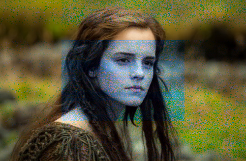
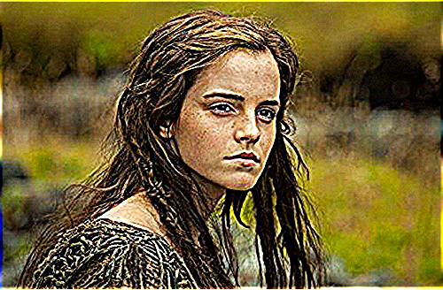
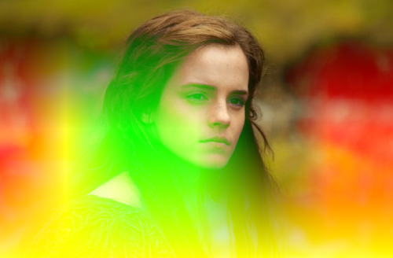

<!-- Autogenerated : 2017-02-05 21:43:51:894677 -->
# See# documentation _(beta!)_

_**WARNING:** The library's soruce code is not for the faint of heart. It is ported legacy-code from an older project._ 
_**WARNING:** This markdown document has been autogenerated by one of the worst C# programs I've ever written ..... so use at your own risk..._

### Defined effects:
The See# Library has a few (57) pre-defined bitmap effects.
The following list contains all pre-defined effects and (in most cases) a generated image rendered with the respective bitmap effect.
The test images used are the following two:
<table><tbody>
<tr><th>emma.png</th><th>hsv_map.png</th></tr>
<tr><td</td><td></td></tr>
</table></tbody>
Effect list:
<ul>
<li><b><code>AddBitmapBlendEffect</code></b>
</li>
<li><b><code>AddBlendColorEffect</code></b>
</li>
<li><b><code>AdditiveNashvilleBitmapEffect</code></b>
    This is a bitmap effect ported from Instagram's CSS code 
</li>
<li><b><code>AdenBitmapEffect</code></b>
    This is a bitmap effect ported from Instagram's CSS code 
</li>
<li><b><code>BitmapTransformEffect</code></b>
</li>
<li><b><code>BrightnessBitmapEffect</code></b>
    Effect applied to ... 
<table><tbody><tr><th>0%</th><th>25%</th><th>50%</th><th>75%</th><th>100%</th></tr><tr>
<td></td><td></td><td></td><td></td><td></td></tr></tbody></table>
</li>
<li><b><code>ContrastBitmapEffect</code></b>
    Effect applied to ... 
<table><tbody><tr><th>0%</th><th>25%</th><th>50%</th><th>75%</th><th>100%</th></tr><tr>
<td></td><td></td><td></td><td></td><td></td></tr></tbody></table>
</li>
<li><b><code>DarkerBitmapBlendEffect</code></b>
</li>
<li><b><code>DarkerOnlyBlendColorEffect</code></b>
</li>
<li><b><code>DifferenceBitmapBlendEffect</code></b>
</li>
<li><b><code>DifferenceBlendColorEffect</code></b>
</li>
<li><b><code>DivideBitmapBlendEffect</code></b>
</li>
<li><b><code>DivideBlendColorEffect</code></b>
</li>
<li><b><code>ED88BitmapEffect</code></b>
    
</li>
<li><b><code>EdgeDetectionBitmapEffect</code></b>
    
</li>
<li><b><code>EmbossBitmapEffect</code></b>
    
</li>
<li><b><code>EngraveBitmapEffect</code></b>
    
</li>
<li><b><code>FastBlurBitmapEffect</code></b>
    
</li>
<li><b><code>FastSharpenerBitmapEffect</code></b>
    
</li>
<li><b><code>Gaussian5x5BitmapEffect</code></b>
    
</li>
<li><b><code>GaussianBlurBitmapEffect</code></b>
    
</li>
<li><b><code>GrayscaleBitmapEffect</code></b>
    Effect applied to ... 
<table><tbody><tr><th>0%</th><th>25%</th><th>50%</th><th>75%</th><th>100%</th></tr><tr>
<td></td><td></td><td></td><td></td><td></td></tr></tbody></table>
</li>
<li><b><code>HardLightBlendColorEffect</code></b>
</li>
<li><b><code>HSLBitmapColorEffect</code></b>
</li>
<li><b><code>InkwellBitmapEffect</code></b>
    This is a bitmap effect ported from Instagram's CSS code 
</li>
<li><b><code>InvertBitmapEffect</code></b>
    Effect applied to ... 
<table><tbody><tr><th>0%</th><th>25%</th><th>50%</th><th>75%</th><th>100%</th></tr><tr>
<td></td><td></td><td></td><td></td><td></td></tr></tbody></table>
</li>
<li><b><code>KirschBitmapEffect</code></b>
</li>
<li><b><code>Laplace5x5BitmapEffect</code></b>
    
</li>
<li><b><code>LighterBitmapBlendEffect</code></b>
</li>
<li><b><code>LighterOnlyBlendColorEffect</code></b>
</li>
<li><b><code>LoFiBitmapEffect</code></b>
    This is a bitmap effect ported from Instagram's CSS code 
</li>
<li><b><code>MultiplyBitmapBlendEffect</code></b>
</li>
<li><b><code>MultiplyBlendColorEffect</code></b>
</li>
<li><b><code>NashvilleBitmapEffect</code></b>
    This is a bitmap effect ported from Instagram's CSS code 
</li>
<li><b><code>NormalMapBitmapEffect</code></b>
</li>
<li><b><code>OpacityBitmapEffect</code></b>
    Effect applied to ... 
<table><tbody><tr><th>0%</th><th>25%</th><th>50%</th><th>75%</th><th>100%</th></tr><tr>
<td></td><td></td><td></td><td></td><td></td></tr></tbody></table>
</li>
<li><b><code>OverlayBitmapBlendEffect</code></b>
</li>
<li><b><code>OverlayBlendColorEffect</code></b>
</li>
<li><b><code>PrewittBitmapEffect</code></b>
</li>
<li><b><code>RemainderBitmapBlendEffect</code></b>
</li>
<li><b><code>RemainderBlendColorEffect</code></b>
</li>
<li><b><code>ReyesBitmapEffect</code></b>
    This is a bitmap effect ported from Instagram's CSS code 
</li>
<li><b><code>RGBSplitBitmapEffect</code></b>
</li>
<li><b><code>SaturationBitmapEffect</code></b>
</li>
<li><b><code>ScharrBitmapEffect</code></b>
</li>
<li><b><code>ScreenBitmapBlendEffect</code></b>
</li>
<li><b><code>ScreenBlendColorEffect</code></b>
</li>
<li><b><code>SepiaBitmapEffect</code></b>
    Effect applied to ... 
<table><tbody><tr><th>0%</th><th>25%</th><th>50%</th><th>75%</th><th>100%</th></tr><tr>
<td></td><td></td><td></td><td></td><td></td></tr></tbody></table>
</li>
<li><b><code>SharpenerBitmapEffect</code></b>
    
</li>
<li><b><code>SimpleGlowBitmapEffect</code></b>
</li>
<li><b><code>SmoothWaldenBitmapEffect</code></b>
    This is a bitmap effect ported from Instagram's CSS code 
</li>
<li><b><code>SobelBitmapEffect</code></b>
</li>
<li><b><code>SoftLightBlendColorEffect</code></b>
</li>
<li><b><code>SubtractBitmapBlendEffect</code></b>
</li>
<li><b><code>SubtractBlendColorEffect</code></b>
</li>
<li><b><code>TintBitmapEffect</code></b>
</li>
<li><b><code>WaldenBitmapEffect</code></b>
    This is a bitmap effect ported from Instagram's CSS code 
</li>
</ul>
